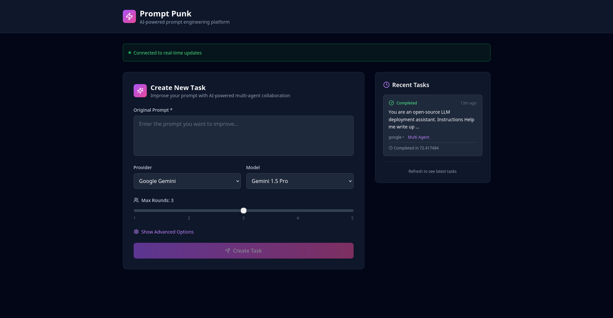

# 🎸 Prompt Punk

**The rebellious AI prompt enhancement platform that rocks your prompts to the next level!**

Prompt Punk is a cutting-edge multi-agent AI system that transforms your basic prompts into powerful, optimized masterpieces. Using a collaborative team of AI agents, it analyzes, improves, and perfects your prompts with punk rock attitude and precision.

## 📸 Preview



*Modern dark UI with real-time WebSocket updates, multi-agent collaboration, and beautiful gradient design*

## 🚀 Features

### 🎯 Multi-Agent Prompt Enhancement
- **Prompt Engineer Agent**: Analyzes and improves your prompts with technical expertise
- **Reviewer Agent**: Provides quality scoring and detailed feedback
- **Lead Agent**: Orchestrates the entire improvement process

### 🤖 Multiple AI Provider Support
- **Google Gemini** (Primary)
- **OpenAI GPT** (Coming Soon)
- **Anthropic Claude** (Coming Soon)

### 🏗️ Architecture Selection
- **Chain-of-Thought**: Step-by-step reasoning approach
- **Meta-Cognitive**: Self-reflective thinking patterns
- **5-Tier Framework**: Comprehensive structured analysis
- **Auto**: Let the system choose the best approach

### ⚡ Real-time Features
- **Live Progress Tracking**: Watch your prompt get enhanced in real-time
- **Background Processing**: Powered by Redis and Sidekiq
- **Session History**: Keep track of all your improvements
- **Quality Scoring**: Get detailed analysis of prompt effectiveness

## 🛠️ Tech Stack

### Backend (Rails 8)
- **Ruby on Rails 8** - Modern API-only backend
- **LangChain Integration** - AI agent orchestration
- **SQLite** - Lightweight database
- **Redis** - Background job processing
- **Sidekiq** - Async task management

### Frontend (React 18+)
- **React 18** with TypeScript
- **Vite** - Lightning-fast development
- **TailwindCSS** - Modern styling
- **Glass-morphism UI** - Beautiful modern interface

## 🐳 Quick Start with Docker

### Prerequisites
- Docker and Docker Compose
- Gemini API Key ([Get one here](https://makersuite.google.com/app/apikey))

### 1. Clone the Repository
```bash
git clone <repository-url>
cd prompt-punk
```

### 2. Set up Environment
```bash
# Copy environment template
cp .env.docker.example .env.docker

### 3. Launch with Docker Compose
```bash
# Start all services
docker compose up -d

# Or use the convenience script
./start.sh
```

### 4. Access the Application
- **Frontend**: http://localhost:5173
- **Backend API**: http://localhost:3000
- **Health Check**: http://localhost:3000/api/v1/health

## 🎸 How to Use

1. **Enter your API key** - Add your Gemini API key in the settings
2. **Write your prompt** - Enter the prompt you want to improve
3. **Choose architecture** - Select improvement approach or use "auto"
4. **Rock and roll!** - Watch the multi-agent system enhance your prompt
5. **Get results** - Receive improved prompt with quality analysis

## 📁 Project Structure

```
prompt-punk/
├── rails_backend/          # Rails API backend
│   ├── app/
│   │   ├── controllers/    # API controllers
│   │   ├── models/        # Data models
│   │   ├── services/      # Business logic
│   │   ├── jobs/          # Background jobs
│   │   └── langchain/     # AI agents
├── frontend/              # React frontend
│   ├── src/
│   │   ├── components/    # React components
│   │   ├── hooks/         # Custom hooks
│   │   └── services/      # API clients
├── docker-compose.yml     # Docker orchestration
└── start.sh              # Quick start script
```

## 🔧 Development

### Backend Development
```bash
cd rails_backend
bundle install
rails server
```

### Frontend Development
```bash
cd frontend
npm install
npm run dev
```

### Background Services
```bash
# Start Redis
redis-server

# Start Sidekiq
cd rails_backend
bundle exec sidekiq
```

## 🎯 API Endpoints

### Tasks
- `POST /api/v1/tasks` - Create new prompt improvement task
- `GET /api/v1/tasks/:id` - Get task status and results
- `DELETE /api/v1/tasks/:id` - Cancel running task
- `GET /api/v1/tasks/recent` - Get recent tasks

### Health
- `GET /api/v1/health` - System health check

## 🤝 Contributing

Prompt Punk welcomes contributions! Whether you're fixing bugs, adding features, or improving documentation, your punk spirit is appreciated.

1. Fork the repository
2. Create your feature branch (`git checkout -b feature/punk-feature`)
3. Commit your changes (`git commit -am 'Add some punk feature'`)
4. Push to the branch (`git push origin feature/punk-feature`)
5. Open a Pull Request

## 📜 License

This project is licensed under the Creative Commons Attribution 4.0 International License - see the LICENSE file for details.

## 🎸 Why "Prompt Punk"?

Because your prompts deserve to be rebellious, powerful, and unforgettable. We don't just improve prompts - we transform them into punk rock masterpieces that get results and break the mold.

**Rock on! 🤘**

---

*Developed as part of the AI Punk project by Netsky*
